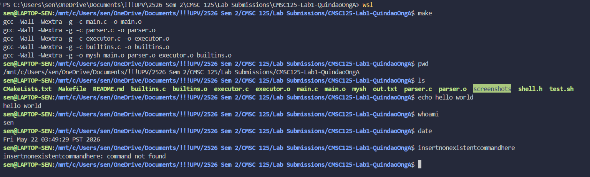
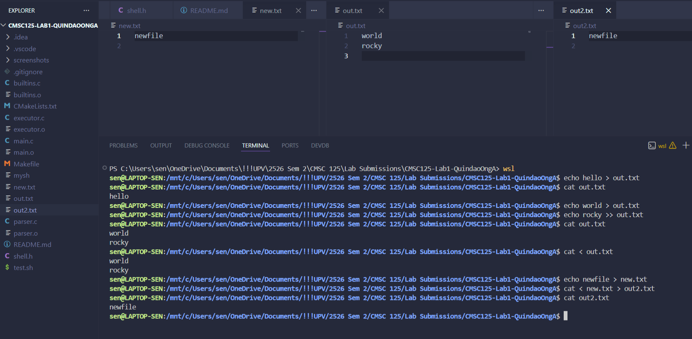
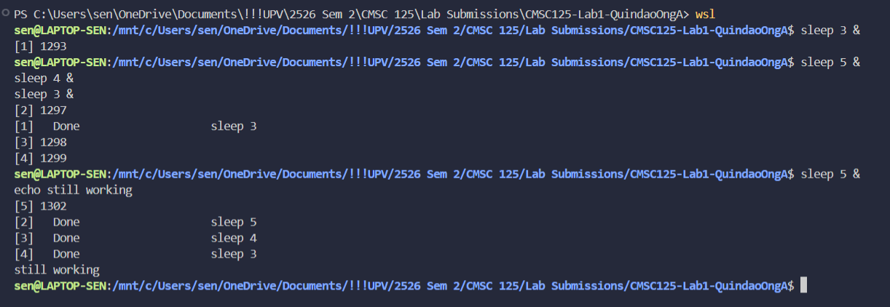

# A Simplified Unix Shell
### CMSC 125-1 Laboratory 1  

Authors: Ong, Andy Dominic X. & Quindao, Hansen Maeve C.   

`mysh` is a simplified Unix shell developed in C using the POSIX API. It demonstrates core operating systems concepts including process management, file descriptor manipulation, I/O redirection, and background execution. The shell presents an interactive prompt, parses user input, and dispatches commands either to built-in handlers or to child processes created via `fork`/`exec`.

---

## Compilation and Setup Instructions

Build: 

```bash
make
```

Clean:  

```bash
make clean
```

Run:

```bash
./mysh
```

The prompt `mysh>` will appear. Type any command and press Enter. Examples of commands are:

```
mysh> echo hello world
mysh> pwd
mysh> cd /tmp
mysh> ls
mysh> exit
```

---

## Features

### Basic External Command Execution
Any program on the system PATH can be run directly.
```
mysh> ls -la
mysh> cat file.txt
mysh> grep hello file.txt
mysh> wc -l file.txt
```

### Built-in Commands
These run inside the shell process itself and do not fork a child.

| Command | Behaviour |
|---------|-----------|
| `exit` | Exits the shell. Accepts an optional exit code: `exit 1` |
| `cd <path>` | Changes the working directory. `cd` alone goes to `$HOME` |
| `pwd` | Prints the current working directory |

### I/O Redirection

| Operator | Behaviour |
|----------|-----------|
| `>` | Redirect stdout to a file (truncates if file exists) |
| `>>` | Redirect stdout to a file (appends if file exists) |
| `<` | Redirect stdin from a file |

Examples:
```
mysh> echo hello > out.txt
mysh> echo world >> out.txt
mysh> cat < out.txt
mysh> cat < input.txt > output.txt
```

### Background Execution
Append `&` to run a command in the background. The shell prints the PID and returns the prompt immediately. Both spaced and no-space forms are supported:
```
mysh> sleep 5 &
mysh> sleep 5&
```

When a background process finishes, the shell reports it at the next prompt:
```
mysh> [1] Background process 4821 finished (exit status 0)
```

---

## Project Structure

```
.
├── main.c          — Interactive prompt loop (REPL), zombie reaping, dispatch
├── parser.c        — Input tokenisation, operator detection, Command struct population
├── builtins.c      — Built-in command implementations: cd, pwd, exit
├── executor.c      — Process creation (fork/exec), I/O redirection (dup2), wait/waitpid
├── shell.h         — Shared header: Command struct definition, all function prototypes
├── Makefile        — Build system
├── test.sh         — Testting
└── README.md 
```

The provided Makefile compiles the source with `-Wall -Wextra` flags to ensure type safety and rigorous error checking during the build process.

### The Command Struct

The central data structure passed between the parser and executor:

```c
typedef struct {
    char *command;         // argv[0]: the program or built-in name
    char *args[256];       // full argument vector, NULL-terminated for execvp
    int   arg_count;       // number of entries in args[]
    char *input_file;      // filename after '<', or NULL
    char *output_file;     // filename after '>' or '>>', or NULL
    int   append;          // 1 = '>>'  /  0 = '>'
    int   background;      // 1 when line ends with '&'
} Command;
```

---

## Testing

Run the automated test suite:

```bash
chmod +x test.sh
./test.sh
```

The script feeds commands into the shell via stdin and validates output, printing results for each section.

### What the Tests Cover

| Section | What is Validated |
|---------|-------------------|
| 1 — Built-in Commands | `pwd`, `cd /tmp`, `cd` (home) |
| 2 — External Commands | `ls`, `ls -la`, `echo`, nonexistent command handling |
| 3 — Output Redirection | `>` truncate, verified with `cat` |
| 4 — Append Redirection | `>>` append, verified with `cat` |
| 5 — Input Redirection | `<` with `wc -l` |
| 6 — Combined Redirection | `< >` together, `> <` reversed order |
| 7 — Background Jobs | single `&`, multiple `&`, shell responsiveness |
| 8 — Error Handling | missing file after `>`, missing file after `<`, nonexistent input file |
| 9 — Edge Cases | empty input, extra whitespace between args, long command lines |

The script also runs a compilation test via `make` before the test cases begin, and cleans up all temporary files (`out.txt`, `input.txt`, `unsorted.txt`, `sorted.txt`, `sorted2.txt`) after the suite finishes.

---

## Architectural Scope and Limitations

- Interactive features like **command history (via readline) were excluded** to focus the implementation on core kernel-level interactions like signal handling and process control.
- **No quoted string support.** The parser splits on whitespace using `strtok`, so paths or arguments containing spaces (e.g. `cd My Documents`) are not handled correctly. Each space-separated word is treated as a separate token.
- **No `cd -` support.** Returning to the previous directory is not implemented (`OLDPWD` is not tracked).
- **Input line length is capped at 1024 characters.** Lines longer than this are silently truncated by `fgets`.
- **No environment variable expansion.** Tokens like `$HOME` or `$PATH` are passed literally to commands and are not expanded by the shell.
- **No signal forwarding.** `SIGINT` (Ctrl-C) currently terminates the entire shell rather than only the foreground child process.

---

## Screenshots

### Basic command execution


### I/O Redirection


### Background jobs

